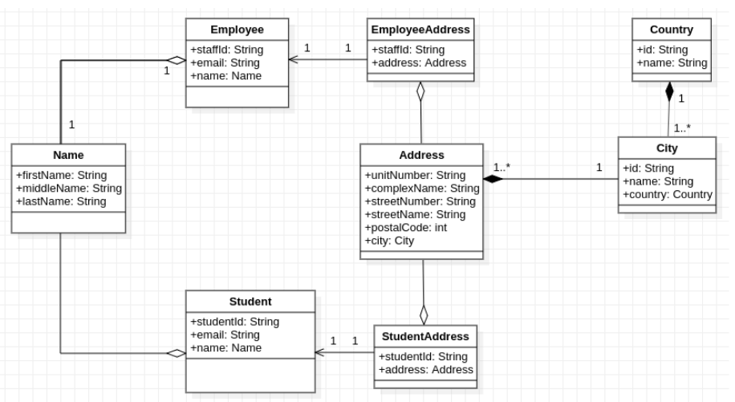

# school_management

In the quest for seamless and effective organisational processes in a college, the technology department of the college has been given the task to digitize and automate its academic-facing processes.

Domain problem: Education

## Group Members

| Student No | Name            | 
|------------|-----------------|
| 216049245  | Brandon Kruger  |
| 218336969  | Guy De La Cruz  |
| 220357676  | Jesse Hiebner   |
| 219350744  | Monehi Tuoane   |
| 219369399  | Lutho Nondala   |
| 219084777  | Siphiwe Chauque |

## UML Diagram

